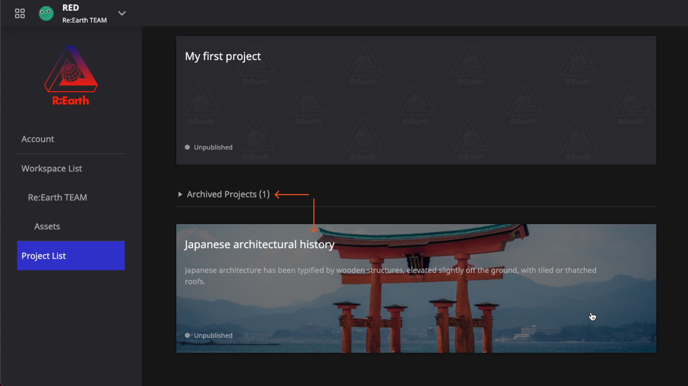

On the current project setting page, you can edit some basic information about the project, or delete or archive the project. 

  A. **Project Info** is the editing area for the basic information of the project. This information is the content you filled in when you created the project, which is used inside the system.

  B. **Danger Zone** Dangerous operation area of the project, provide archive and delete project operations.

## Archive your project

When you are making more and more projects, and some projects have come to an end, and you will not modify them for the time being, you can archive these projects.

The archive operation will not delete the project data, it will only turn it into read-only mode. When you want to modify the project again, just release the project from the archive mode.

In the danger zone at the bottom of the setting page, you can find the archive operation button.

## Archive status and release

Once the project is archived, you will not be able to find it on the Dashboard page. But you can find him on the Project list page.

Once the project is archived, you will not be able to find it on the Dashboard page. But you can find him on the Project list page.

Once the project is archived, you will not be able to find it on the Dashboard page. But you can find him on the Project list page.

## Delete your project

When you find that some projects are no longer needed, you can delete them completely. For Re:Earth, deleting a project means completely removing all information and data about the project.

In the danger zone at the bottom of the setting page, you can find the delete operation button.

:::caution
This is an operation that cannot be undone or returned, so please use this operation carefully.
:::

